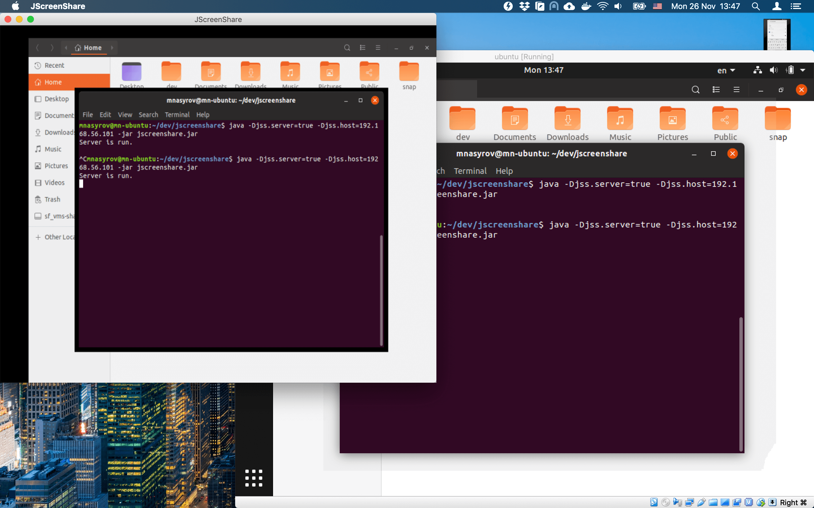

# JScreenShare

A pure Java 8+ command-line tool for sharing a screen between computers.
It's goal to be a minimalistic as possible.

Features:
* Automatically sends screenshots from a server to a client.
* No external dependencies.

## Building

Clean:
    
    rm -rf ./build jscreenshare.jar

Compile:

    mkdir -p build && javac -d build src/*.java

Package a jar file:
    
    jar cvfe jscreenshare.jar JScreenShare -C build .
    
    
## Usage       

Start server:

    java -Djss.server=true -jar jscreenshare.jar
    

Start client:

    java -Djss.host=localhost -jar jscreenshare.jar
    
    
System properties:

* `jss.server` = `false` (optional)
    * Enables server mode when it is `true`.
    
* `jss.host` = `127.0.0.1` (optional):
    * Server: IP address of the server to listen.
    * Client: Host name or IP address of the server to connect.
    
* `jss.port` = `12345` (optional):
    * Server: The port which the server will listen.
    * Client: Port of the server to connect.
    
* `jss.refreshPeriod` = `5` (optional):
    * Client: If greater than `0` then the client refresh a server's screen once per the period.
        
* `jss.imageScale` = `false` (optional):
    * Client: If enabled then a screenshot is resized to fill a client window. Otherwise, scrollbars are added to scroll the image.
